# Merge Scenarios

This guide explains what happens in various merge scenarios with visual gitgraph diagrams.

## Table of Contents

1. [Remote Change Merged into PR Branch](#remote-change-merged-into-pr-branch)
2. [PR Merged into Target Branch](#pr-merged-into-target-branch)
3. [Stack Merging Strategy](#stack-merging-strategy)
4. [Conflicts During Merge](#conflicts-during-merge)
5. [Squash Merge vs Merge Commit](#squash-merge-vs-merge-commit)

---

## Remote Change Merged into PR Branch

### Scenario: Collaborator Pushes to Your PR Branch

When someone else pushes commits to your PR branch (e.g., Copilot suggestion, collaborator help), those changes need to be synced to your local branch.

#### Before Sync

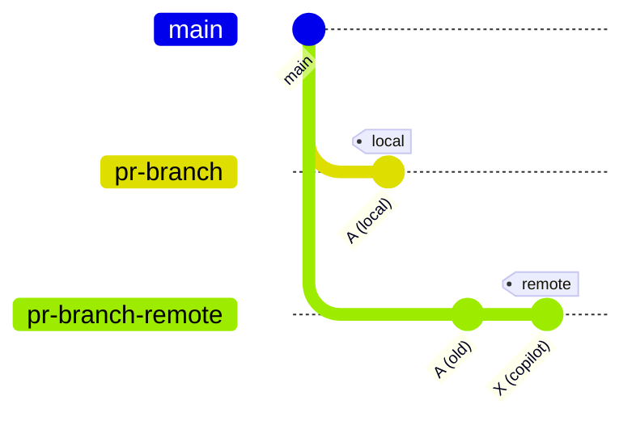

**State**:
- Local commit: `A` (your version)
- Remote commit: `A → X` (includes Copilot's changes)

#### After `jj-pr sync`

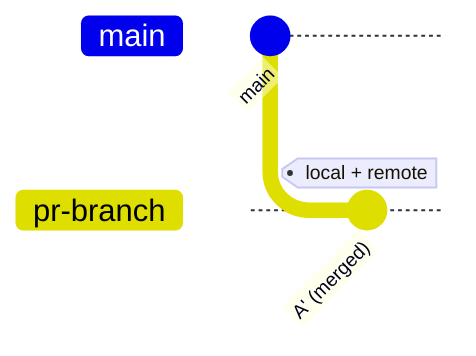

**What Happened**:
1. jjpr fetches remote `X`
2. JJ squashes `X` onto local `A`
3. Result is `A'` containing both your work and remote changes
4. `A'` is pushed back to remote PR branch

**Commands**:
```bash
# Detect changes
$ jj-pr sync --status
📝 Commit 1/1
   PR: #42
   ⬇️  Remote has 1 new commit(s)

# Sync
$ jj-pr sync
🔄 Merging remote changes...
✅ Successfully merged
⬆️  Pushing to remote...
✅ Synced successfully
```

#### Local View (JJ)

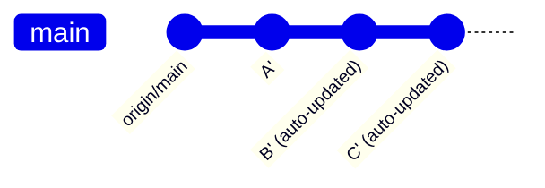

**Note**: JJ automatically propagates changes from `A'` to downstream commits `B` and `C`.

---

## PR Merged into Target Branch

### Scenario: Bottom PR in Stack Merges

When the bottom PR in your stack is merged into `main`, you need to update the remaining PRs to target `main` instead of the merged PR's branch.

#### Before Merge: Three-PR Stack

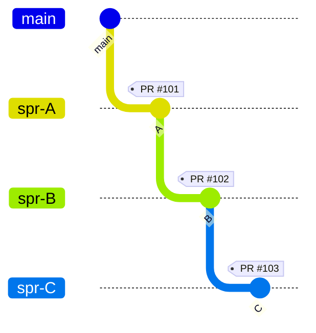

**PR Relationships**:
- PR #101 (A): base = `main`
- PR #102 (B): base = `spr-A`
- PR #103 (C): base = `spr-B`

#### PR #101 Merged

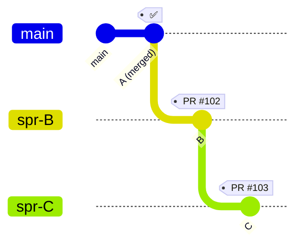

**On GitHub**:
- `main` now includes `A`
- PR #102 (B) still targets `spr-A` (which is now part of main)
- PR #103 (C) still targets `spr-B`

#### Update with `jj-pr mail`

```bash
# Update local
$ git fetch origin main
$ jj git import

# Update PR bases
$ jj-pr mail
📬 Finding commits to mail...

📝 Processing commit 1/2
   Change ID: bbb...
   PR: #102 (existing)
   📤 Updating pull request #102...
   🔄 Updated base: main (was spr-A)

📝 Processing commit 2/2
   Change ID: ccc...
   PR: #103 (existing)
   ✅ Base unchanged: spr-B
```

#### After Update

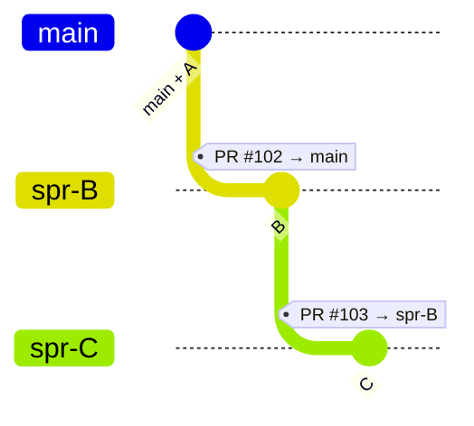

**PR Relationships Now**:
- PR #102 (B): base = `main` ✅
- PR #103 (C): base = `spr-B` (unchanged)

---

## Stack Merging Strategy

### Full Stack Merge Process

Starting with a 3-PR stack:

#### Initial Stack


### Step 1: Merge PR #101

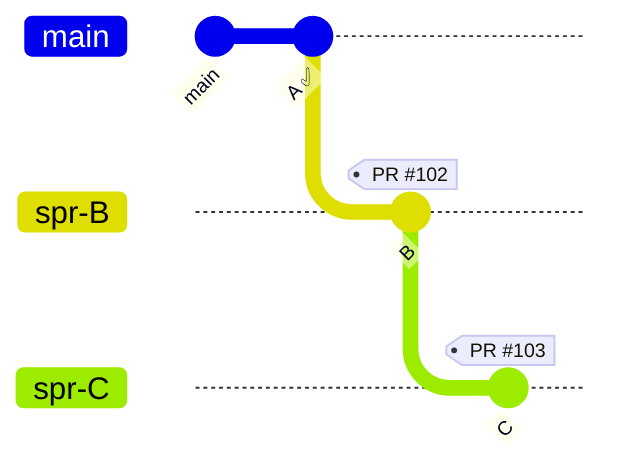

**Actions**:
```bash
# On GitHub: Merge PR #101
# Locally:
$ git fetch origin main
$ jj git import
$ jj-pr mail
# → PR #102 now targets main
```

### Step 2: Merge PR #102

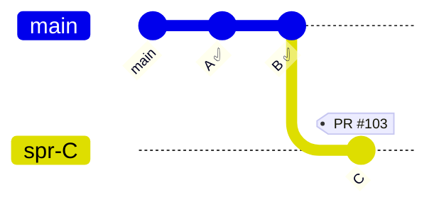

**Actions**:
```bash
# On GitHub: Merge PR #102
# Locally:
$ git fetch origin main
$ jj git import
$ jj-pr mail
# → PR #103 now targets main
```

### Step 3: Merge PR #103

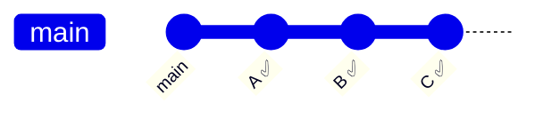

**Actions**:
```bash
# On GitHub: Merge PR #103
# Stack complete! 🎉
```

### Local Cleanup

```bash
# Abandon merged commits (optional)
$ jj abandon aaa bbb ccc

# Or keep for history
$ jj new main  # Start fresh from main
```

---

## Conflicts During Merge

### Scenario: Base Branch Updated, PR Has Conflicts

#### Setup

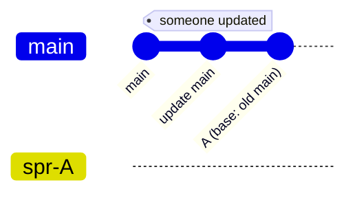

**Problem**: `A` was created from old `main`, new commits added to `main`, now conflicts exist.

#### On GitHub

GitHub shows: "This branch has conflicts that must be resolved"

#### Option 1: Rebase Locally

```bash
# Rebase A onto new main
$ jj rebase -r aaa -d origin/main

# Resolve conflicts if any
$ vim conflicted_file.rs

# Update PR
$ jj-pr mail
$ jj-pr sync
```

**Result**:

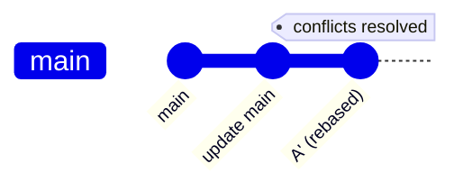

#### Option 2: Merge Main into PR Branch

On GitHub:
1. Click "Resolve conflicts"
2. Choose "Update branch" (merges main into PR branch)

Then locally:

```bash
# Sync to get the merge commit
$ jj-pr sync
```

**Result**:

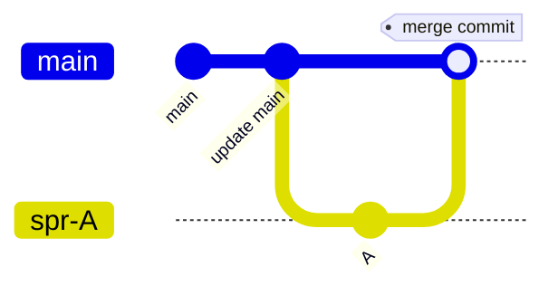

**Note**: Creates a merge commit. Rebasing (Option 1) keeps history cleaner.

---

## Squash Merge vs Merge Commit

GitHub offers different merge strategies. jjpr works with all, but has implications.

### Squash Merge (Recommended)

#### GitHub UI: "Squash and merge"

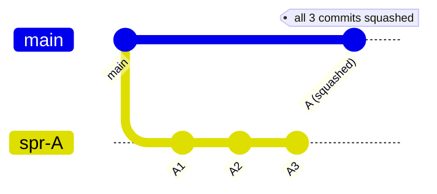

**Result**: All commits in PR branch squashed into one commit on `main`.

**Pros**:
- ✅ Clean main branch history
- ✅ Easy to revert
- ✅ Matches jjpr's change-based model

**Cons**:
- ❌ Loses individual commit history
- ❌ May need to rebase remaining PRs

**jjpr Handling**:
```bash
$ git fetch origin main
$ jj git import
$ jj-pr mail
# Works automatically
```

### Merge Commit

#### GitHub UI: "Create a merge commit"

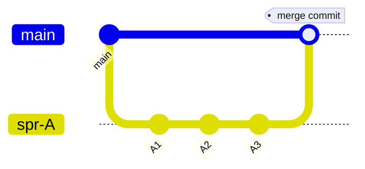

**Result**: Merge commit created, preserves all PR commits.

**Pros**:
- ✅ Preserves full history
- ✅ Shows PR structure in main

**Cons**:
- ❌ Cluttered main history
- ❌ Harder to revert

**jjpr Handling**:
```bash
$ git fetch origin main
$ jj git import
$ jj-pr mail
# Works automatically
```

### Rebase Merge

#### GitHub UI: "Rebase and merge"

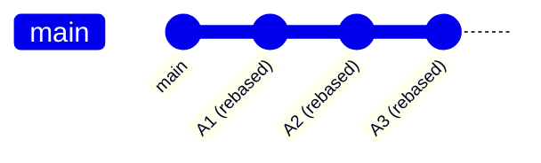

**Result**: PR commits replayed onto main (new commit SHAs).

**Pros**:
- ✅ Linear history
- ✅ Preserves individual commits

**Cons**:
- ❌ Changes commit SHAs
- ❌ Can confuse tools tracking commits

**jjpr Handling**:
```bash
$ git fetch origin main
$ jj git import
$ jj-pr mail
# Works, but local commits won't match remote SHAs
```

---

## Complex Scenario: Mid-Stack Merge

### What If PR #102 (Middle) Merges Before PR #101?

This is uncommon but can happen.

#### Initial Stack


#### PR #102 Merged First (includes A + B)

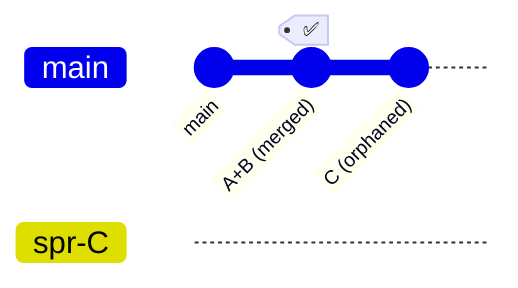

**Problem**: PR #103 (C) still targets `spr-B`, but B is now merged.

**Solution**:

```bash
# Update local
$ git fetch origin main
$ jj git import

# Rebase C onto new main
$ jj rebase -r ccc -d origin/main

# Update PR
$ jj-pr mail
# → PR #103 now targets main
# → PR #101 can be closed (already merged as part of #102)
```

---

## Sync After Merge

### Common Pattern: Merge Then Sync

```bash
# 1. PR merged on GitHub
# On GitHub: Merge PR #101

# 2. Update local main
$ git fetch origin main
$ jj git import

# 3. Check what changed
$ jj log

# 4. Update remaining PRs
$ jj-pr mail

# 5. Sync any changes
$ jj-pr sync --status
$ jj-pr sync

# 6. Clean up (optional)
$ jj abandon aaa  # Abandon merged commit
```

---

## Visualizing Your Stack

### Using JJ Log

```bash
# View full stack
$ jj log -r 'origin/main..@'

# With graph
$ jj log -r 'origin/main..@' --graph
```

**Example Output**:
```
@  ccc789 C
│  Add feature C
│  Pull Request: #103
○  bbb456 B
│  Add feature B
│  Pull Request: #102
○  aaa123 A
│  Add feature A
│  Pull Request: #101
◆  origin/main
```

### After PR #101 Merges

```bash
$ git fetch origin main && jj git import
$ jj log -r 'origin/main..@'
```

**Output**:
```
@  ccc789 C
│  Add feature C
│  Pull Request: #103
○  bbb456 B
│  Add feature B
│  Pull Request: #102
◆  origin/main (includes A now)
```

---

## Best Practices

### 1. Merge Bottom-Up

Always merge from the bottom of the stack:
- Merge PR #101 (A)
- Then merge PR #102 (B)
- Finally merge PR #103 (C)

### 2. Update After Each Merge

After each merge:
```bash
git fetch origin main
jj git import
jj-pr mail
```

### 3. Handle Conflicts Immediately

Don't let conflicts accumulate:
- Fix conflicts as soon as detected
- Test after resolving
- Update PR immediately

### 4. Prefer Squash Merge

For clean history:
- Use "Squash and merge" on GitHub
- Keeps main branch clean
- Matches jjpr's change model

### 5. Cleanup Merged Commits

```bash
# After merge
$ jj abandon <merged-change-id>

# Or start fresh
$ jj new origin/main
```

---

## Summary

| Scenario | Command | Outcome |
|----------|---------|---------|
| Remote pushes to PR | `jj-pr sync` | Merges remote changes locally |
| PR merged into main | `git fetch && jj git import && jj-pr mail` | Updates remaining PR bases |
| Conflict with main | `jj rebase -r X -d origin/main` | Rebases PR onto updated main |
| Clean up after merge | `jj abandon X` | Removes merged commit from stack |

---

## Next Steps

- [Sync Deep Dive](sync.md) - Understand sync behavior
- [Workflows](workflows.md) - Common usage patterns
- [Commands](commands.md) - Command reference
